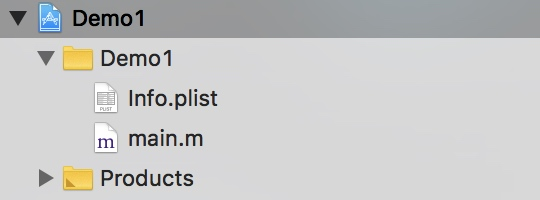
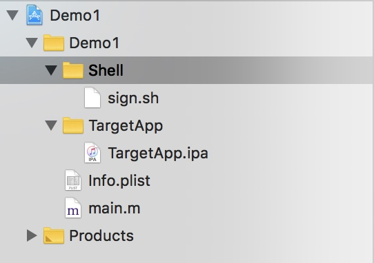
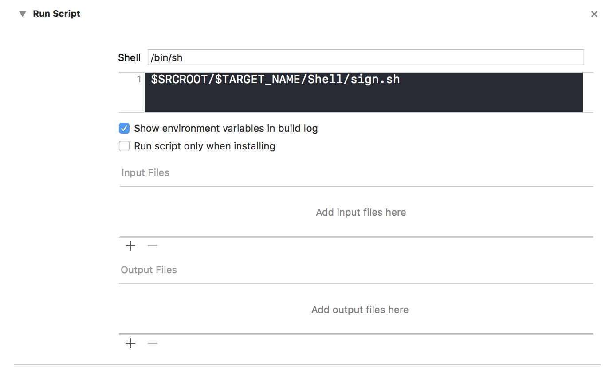

#动态调试3方APP
##原理
Xcode在构建完工程之后会在Products文件目录生成.app文件，然后会将这个.app文件安装在设备上。只要我们在构建完工程之后，把我们准备好的重签名的第三方包复制到这里就可以运行起来了。
##动态调试
生成一个dylib的动态库，动态库内容是hook的TargetApp的内容，并打到TargetAPP里，并重签名，即可调试。
##准备
Xcode Optool 去壳的TargetApp
**Optool**：注入动态库工具
##安装optool：
```
git clone --recursive https://github.com/alexzielenski/optool.git
```
打开git库，Xocde编译该工程得到optool二进制文件，然后把该文件放到/usr/local/bin/目录下即可
##开始
新建普通工程，删掉不需要的东西，只留这些足够


新建TargetApp&&Shell文件夹，
**TargetApp**：用来存放要调试的App
**Shell**：用来写shell脚本
然后就这个样子了

**脚本怎么用呢？**
project->target->build phases->**+**->new run script phase
这样就可在编译完成后运行shell脚本了

注：/shell/sign.sh: Permission denied如果出现这个错误，表明该.sh文件没有执行权限，赋一下权限就好啦。。。
```chmod +x sign.sh```
**脚本内容**
```Target_IPA_Path=$(find "$SRCROOT/$TARGET_NAME/TargetApp" -type f | grep ".ipa$" | head -n 1)
Target_IPA_Name=$(basename "$Target_IPA_Path" .ipa)
Target_IPA_Unzip_Temp="$SRCROOT/$TARGET_NAME/TargetApp/Temp"
CUSTOM_DISPLAY_NAME=$(/usr/libexec/PlistBuddy -c "Print CFBundleDisplayName"  "${SRCROOT}/$TARGET_NAME/Info.plist")
CUSTOM_URL_TYPE=$(/usr/libexec/PlistBuddy -x -c "Print CFBundleURLTypes"  "${SRCROOT}/$TARGET_NAME/Info.plist")
rm -r "$Target_IPA_Unzip_Temp"
unzip -u "$Target_IPA_Path" -d "$Target_IPA_Unzip_Temp"
Target_APP_Payload_Path="$Target_IPA_Unzip_Temp/Payload"
Target_App_Path=$(find "$Target_APP_Payload_Path" -type d | grep ".app$" | head -n 1)
Self_APP_Path="$Target_APP_Payload_Path/$TARGET_NAME"".app"
mv "$Target_App_Path" "$Self_APP_Path"
rm "$Self_APP_Path/_CodeSignature"
BUILD_APP_PATH="$BUILT_PRODUCTS_DIR/$TARGET_NAME.app"
mv "$BUILD_APP_PATH/embedded.mobileprovision" "$Self_APP_Path"
if [[ "$CUSTOM_DISPLAY_NAME" != "" ]]; then
    /usr/libexec/PlistBuddy -c "Set :CFBundleDisplayName $CUSTOM_DISPLAY_NAME" "$Self_APP_Path/Info.plist"
fi
/usr/libexec/PlistBuddy -c "Set :CFBundleIdentifier $PRODUCT_BUNDLE_IDENTIFIER" "$Self_APP_Path/Info.plist"
APP_BINARY=`plutil -convert xml1 -o - $Self_APP_Path/Info.plist | grep -A1 Exec | tail -n1 | cut -f2 -d\> | cut -f1 -d\<`
rm -r "$BUILD_APP_PATH"
mv "$Self_APP_Path" "$(dirname "$BUILD_APP_PATH")"
chmod +x "$BUILD_APP_PATH/$APP_BINARY"
echo "-------------------开始签名--------------------"
/usr/bin/codesign --force --sign "$EXPANDED_CODE_SIGN_IDENTITY" "$BUILD_APP_PATH"
echo "--------------------结束签名--------------------"```
##怎么生成动态库并调试呢？？？？
**生成动态库**
project->target->**+**->Framework&Libarary->CocoaTouchFrameWork
名字命名为**lib+工程名+Dylib.dylib**
**exscuse me 动态库呢？？？**
右键project->show in finder->右键project->显示包->project.pbxproj
```productType = "com.apple.product-type.framework";```
改为
```productType = "com.apple.product-type.library.dynamic";```
关闭之后再看看工程呢？/斜眼笑
##怎么Hook函数呢？？？
引入一个文件https://github.com/rpetrich/CaptainHook
**Hook函数编写**
file->new->file->object-C File.m
新建HookAppDelegate.m
Hook一下AppDelegate的启动方法
```import <CaptainHook.h>
CHDeclareClass(AppDelegate)
CHMethod2(BOOL,AppDelegate, application, id, arg1, didFinishLaunchingWithOptions, id, arg2){
    BOOL i = CHSuper2(AppDelegate, application, arg1, didFinishLaunchingWithOptions, arg2);
    UIAlertView * v = [[UIAlertView alloc] initWithTitle:@"AppDelegate" message:@"didFinishLaunchingWithOptions" delegate:nil cancelButtonTitle:@"确定" otherButtonTitles:nil, nil];
    [v show];
    return i;
}
CHConstructor{
    CHLoadLateClass(AppDelegate);
    CHHook2(AppDelegate, application, didFinishLaunchingWithOptions);
}```
##到这里还是不能调试动态库，exscuse me？
在shell脚本里把动态库注入到App里哇。
在签名之前加入内容
```Lib_Target_Dylib_Path="@executable_path/Frameworks/lib""$TARGET_NAME""Dylib.dylib"
if [ ! -d "$Lib_Target_Dylib_Path" ];then
    echo "动态库不存在 跳过"
else
    echo "开始注入"
    optool install -c load -p "@executable_path/Frameworks/lib""$TARGET_NAME""Dylib.dylib" -t "$BUILD_APP_PATH/$APP_BINARY"
    optool unrestrict -w -t "$BUILD_APP_PATH/$APP_BINARY"
    echo "注入成功"
fi```
##如果项目依赖有framework咋办呢？
对这些framework和dylib逐个签名

##报错
1.This app contains an app extension with an illegal bundle identifier. App extension bundle identifiers must have a prefix consisting of their containing application's bundle identifier followed by a '.'.
把原来相同的bundleID的引用删掉

##end


